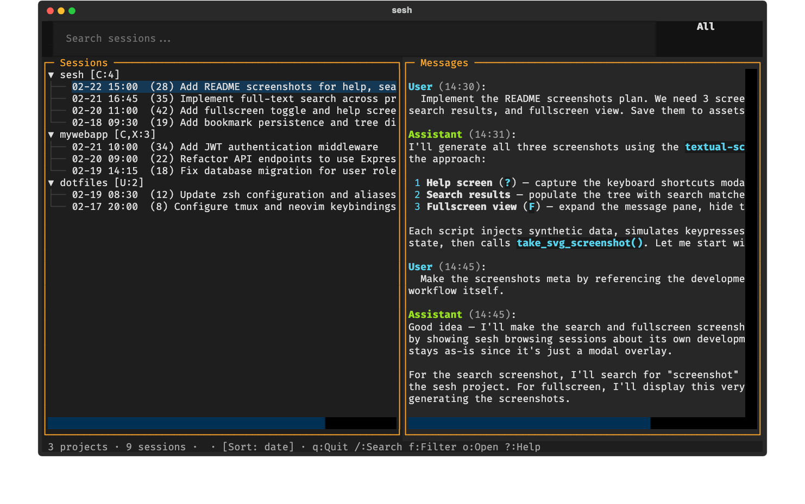
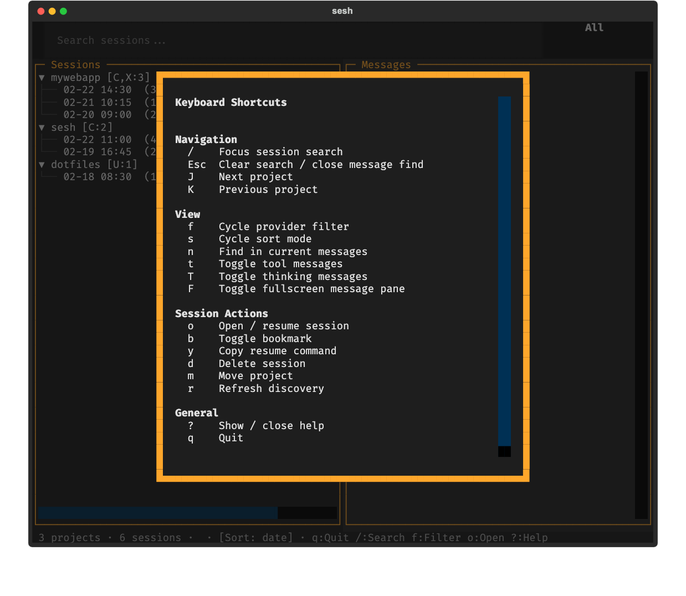

# sesh

Browse and search Claude Code, Codex, and Cursor sessions in the
terminal.

`sesh` is a TUI that discovers session logs from multiple LLM coding
assistants, lets you browse them by project, read message threads, and
full-text search across all of them.

It also has a CLI that outputs JSON, so LLM agents can query session
history programmatically.

Inspired by [Claude Code UI](https://github.com/siteboon/claudecodeui).



## Install

Install directly from GitHub:

```
uv tool install git+https://github.com/ddarmon/sesh
```

Or from a local clone:

```
uv tool install /path/to/this/repo
```

To reinstall after changes:

```
uv tool install --force --reinstall /path/to/this/repo
```

Or run without installing:

```
uv run --directory /path/to/this/repo sesh
```

Requires Python 3.10+ and
[ripgrep](https://github.com/BurntSushi/ripgrep) for full-text search.

## Platform support

Developed and tested on macOS. The codebase uses `pathlib.Path` and
`shutil.which()` throughout, so most of it is platform-agnostic.

**Linux** -- Should work out of the box. The Claude Code, Codex, and
Cursor data directories use the same paths as macOS (`~/.claude`,
`~/.codex`, `~/.cursor`). Textual and ripgrep both support Linux.

**Windows** -- Partially supported. The core TUI and CLI will run, but
the Cursor provider's workspace storage path may not resolve correctly
(it defaults to a Linux-style path instead of `AppData/Roaming/Cursor`
on Windows). Claude Code and Codex path resolution should work via
`Path.home()`. Ripgrep is available on Windows via `winget` or
`choco install ripgrep`.

## Usage

### TUI

Launch with `sesh`. The TUI loads sessions in the background and
populates a project tree on the left. Select a session to view its
messages on the right. Session labels show relative timestamps ("2h
ago", "yesterday") and session durations ("\~45m", "\~2h") for recent
sessions. View preferences -- provider filter, sort mode, and visibility
toggles -- persist across launches.

#### Keybindings

| Key      | Action                                             |
| -------- | -------------------------------------------------- |
| `/`      | Focus the search bar                               |
| `Escape` | Clear search and return to full tree               |
| `f`      | Cycle provider filter (All/Claude/Codex/Cursor)    |
| `o`      | Open/resume the selected session in its CLI        |
| `e`      | Export session to clipboard as Markdown            |
| `d`      | Delete the selected session (with confirmation)    |
| `m`      | Move selected project path (full or metadata-only) |
| `t`      | Toggle tool call/result visibility                 |
| `T`      | Toggle thinking/reasoning visibility               |
| `F`      | Toggle fullscreen message pane                     |
| `?`      | Show keyboard shortcuts help                       |
| `q`      | Quit                                               |

Press `?` at any time to see all keyboard shortcuts:



Press `F` to toggle fullscreen reading mode, which hides the session
tree and expands the message pane to fill the terminal:


#### Search

-   **Filter-as-you-type**: Typing in the search bar instantly filters
    the tree by project name and session summary.
-   **Full-text search**: Press `Enter` to run a ripgrep search across
    all session JSONL files. Results appear in the tree with provider
    badges and matched context.


#### Provider badges

Each project in the tree shows which providers have sessions for it:

-   `C` -- Claude Code
-   `X` -- Codex
-   `U` -- Cursor

Example: `myproject [C,X:12]` means 12 sessions from Claude and Codex.

### CLI

All subcommands output JSON to stdout. Run `sesh refresh` first to build
an index, then query it.

```
sesh refresh                              # discover sessions, build index
sesh projects                             # list all projects
sesh sessions                             # list all sessions
sesh sessions --project /path/to/project  # filter by project
sesh sessions --provider claude           # filter by provider
sesh messages <session-id>                # read messages
sesh messages <session-id> --summary      # user messages only
sesh messages <session-id> --limit 10     # first 10 messages
sesh messages <session-id> --include-tools  # include tool calls/results
sesh messages <session-id> --full         # include tools + thinking
sesh search "some query"                  # full-text search via ripgrep
sesh clean "some query" --dry-run         # preview matching sessions to delete
sesh resume <session-id>                  # resume in provider CLI
sesh export <session-id> --format json    # export session transcript
sesh export <session-id> --full           # export with tools + thinking
sesh move /old/path /new/path --dry-run   # preview project move changes
sesh move /old/path /new/path             # full move + metadata rewrite
sesh move /old/path /new/path --metadata-only  # metadata rewrite only
```

Run `sesh --help` or `sesh <command> --help` for full details.

### Move project paths

Use `m` in the TUI on a project or session node to move that project's
path. The dialog supports:

-   **Full Move**: moves files on disk and updates provider metadata.
-   **Metadata Only**: updates provider metadata only, for projects
    already moved manually.

CLI equivalent:

```
sesh move <old-path> <new-path>
sesh move <old-path> <new-path> --metadata-only
sesh move <old-path> <new-path> --dry-run
```

### Using with LLM agents

The CLI is designed so that an LLM agent (like Claude Code or Codex) can
explore your session history via Bash. The agent can run `sesh --help`
to learn the commands, then query as needed. Some things to try:

**"What was I working on last week?"**

The agent can list recent sessions across all projects and read their
summaries:

```
sesh refresh
sesh sessions | jq '[.[] | select(.timestamp > "2026-02-09")] | sort_by(.timestamp) | reverse'
sesh messages <session-id> --summary
```

**"Find all sessions where I worked on authentication"**

Full-text search returns matching sessions with context:

```
sesh search "authentication"
sesh messages <session-id> --limit 20
```

**"Summarize what I did in a specific project"**

Filter sessions by project, then read through them:

```
sesh sessions --project /path/to/project
sesh messages <session-id> --summary   # repeat for each session
```

**"Which providers did I use for a topic?"**

Search returns the provider for each match, so the agent can group
results by provider to compare how different tools were used for the
same topic.

## Providers

### Claude Code

Reads `~/.claude/projects/` JSONL files. Resolves project paths from the
`cwd` field in session entries. Groups sessions by conversation thread
(first user message UUID) and shows only the latest from each group.
Extracts summaries from `type: "summary"` entries, falling back to the
last user message.

### Codex

Reads `~/.codex/sessions/YYYY/MM/DD/*.jsonl`. Supports two formats:

-   **New format**: First line has `type: "session_meta"` with `cwd` in
    the payload.
-   **Legacy format**: Extracts `<cwd>` from `<environment_context>` XML
    in response items.

### Cursor

Reads `~/.cursor/chats/{md5(project_path)}/*/store.db` SQLite databases.
Discovers sessions by computing MD5 hashes of known project paths from
other providers. Returns empty gracefully if `~/.cursor/chats/` doesn't
exist.

## Cache

Parsed session metadata is cached at `~/.cache/sesh/sessions.json`,
keyed by file path with mtime/size for invalidation. The CLI index is
stored at `~/.cache/sesh/index.json`. View preferences (provider filter,
sort mode, visibility toggles) are saved to
`~/.cache/sesh/preferences.json`.

## Project structure

```
src/sesh/
  __init__.py        # version
  __main__.py        # python -m sesh
  cli.py             # argparse CLI with JSON subcommands
  app.py             # Textual TUI, layout, keybindings
  bookmarks.py       # bookmark persistence (load/save)
  preferences.py     # view preference persistence (load/save)
  export.py          # shared Markdown export formatter
  discovery.py       # shared discovery logic (used by TUI and CLI)
  models.py          # Project, SessionMeta, Message, SearchResult, MoveReport
  move.py            # project move orchestration across providers
  cache.py           # JSON metadata cache + index
  search.py          # ripgrep full-text search
  providers/
    __init__.py      # SessionProvider base class
    claude.py        # Claude Code JSONL parser
    codex.py         # Codex JSONL parser
    cursor.py        # Cursor SQLite parser
```

