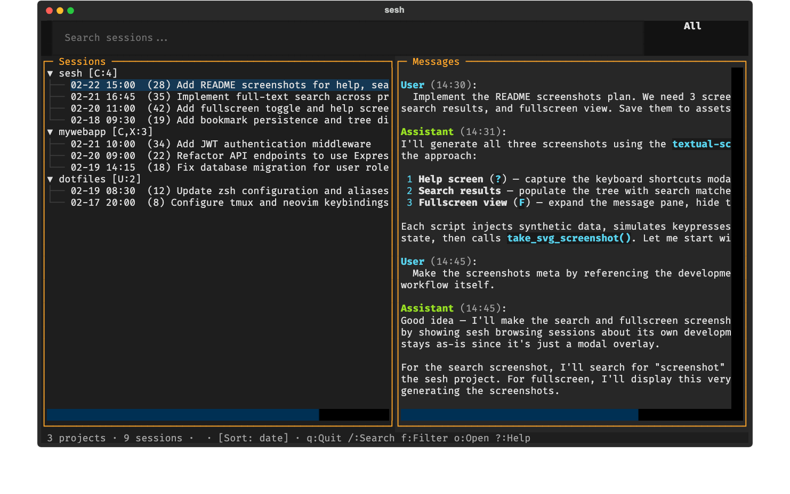
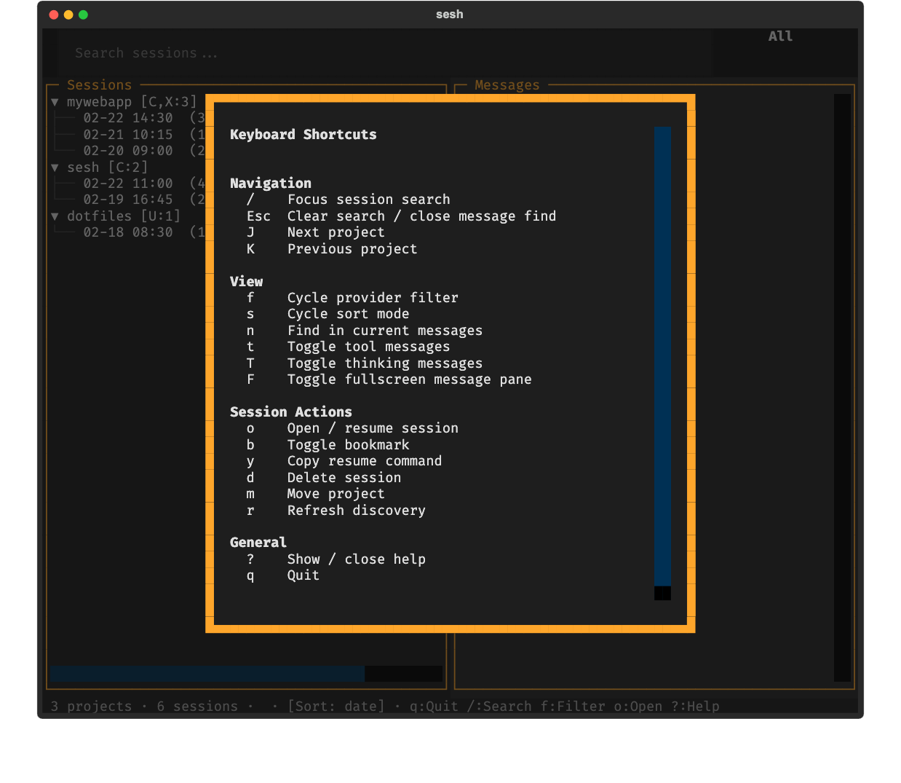

# sesh

Browse and search Claude Code, Codex, Cursor, Copilot, pi, Gemini CLI,
and opencode sessions in the terminal.

`sesh` is a TUI that discovers session logs from multiple LLM coding
assistants, lets you browse them by project, read message threads, and
full-text search across all of them.

It also has a CLI that outputs JSON, so LLM agents can query session
history programmatically.

Inspired by [Claude Code UI](https://github.com/siteboon/claudecodeui).



## Install

Install directly from GitHub:

```
uv tool install git+https://github.com/ddarmon/sesh
```

Or from a local clone:

```
uv tool install /path/to/this/repo
```

To reinstall after changes:

```
uv tool install --force --reinstall /path/to/this/repo
```

Or run without installing:

```
uv run --directory /path/to/this/repo sesh
```

Requires Python 3.10+ and
[ripgrep](https://github.com/BurntSushi/ripgrep) for full-text search.

## Platform support

Developed and tested on macOS. The codebase uses `pathlib.Path` and
`shutil.which()` throughout, so most of it is platform-agnostic.

**Linux** -- Should work out of the box. The Claude Code, Codex, Cursor,
Copilot, pi, Gemini, and opencode data directories use the same paths
as macOS (`~/.claude`, `~/.codex`, `~/.cursor`, `~/.copilot`, `~/.pi`,
`~/.gemini`, `~/.local/share/opencode`). Textual and ripgrep both
support Linux.

**Windows** -- Partially supported. The core TUI and CLI will run, but
the Cursor provider's workspace storage path may not resolve correctly
(it defaults to a Linux-style path instead of `AppData/Roaming/Cursor`
on Windows). Claude Code, Codex, Copilot, pi, and Gemini path
resolution should work via `Path.home()`. Ripgrep is available on Windows via `winget` or
`choco install ripgrep`.

## Usage

### TUI

Launch with `sesh`. The TUI loads sessions in the background and
populates a project tree on the left. Select a session to view its
messages on the right. Session labels show relative timestamps ("2h
ago", "yesterday") and session durations ("\~45m", "\~2h") for recent
sessions. View preferences -- provider filter, sort mode, and visibility
toggles -- persist across launches.

#### Keybindings

| Key      | Action                                                     |
| -------- | ---------------------------------------------------------- |
| `/`      | Focus the search bar                                       |
| `Escape` | Clear search and return to full tree                       |
| `f`      | Cycle provider filter (All/Claude/Codex/Cursor/Copilot/pi/Gemini/opencode) |
| `o`      | Open/resume the selected session in its CLI                |
| `e`      | Export session to clipboard as Markdown                    |
| `d`      | Delete the selected session (with confirmation)            |
| `m`      | Move selected project path (full or metadata-only)         |
| `t`      | Toggle tool call/result visibility                         |
| `T`      | Toggle thinking/reasoning visibility                       |
| `F`      | Toggle fullscreen message pane                             |
| `S`      | Open Terminal-tab snapshots (macOS only)                   |
| `?`      | Show keyboard shortcuts help                               |
| `q`      | Quit                                                       |

Press `?` at any time to see all keyboard shortcuts:



Press `F` to toggle fullscreen reading mode, which hides the session
tree and expands the message pane to fill the terminal:


#### Search

-   **Filter-as-you-type**: Typing in the search bar instantly filters
    the tree by project name and session summary.
-   **Full-text search**: Press `Enter` to run a ripgrep search across
    all session JSONL files. Results appear in the tree with provider
    badges and matched context.


#### Provider badges

Each project in the tree shows which providers have sessions for it:

-   `C` -- Claude Code
-   `X` -- Codex
-   `U` -- Cursor
-   `P` -- Copilot
-   `π` -- pi
-   `G` -- Gemini CLI
-   `O` -- opencode

Example: `myproject [C,X:12]` means 12 sessions from Claude and Codex.

### CLI

All subcommands output JSON to stdout. Run `sesh refresh` first to build
an index, then query it. Add `--aggregation-root PATH` (or set
`SESH_AGGREGATION_ROOT` in the environment) to any command to browse a
multi-host aggregation tree instead of the local `$HOME` --- see
[Aggregation mode](#aggregation-mode-cross-machine-browsing).

```
sesh refresh                              # discover sessions, build index
sesh projects                             # list all projects
sesh sessions                             # list all sessions
sesh sessions --project /path/to/project  # filter by project
sesh sessions --provider claude           # filter by provider
sesh sessions --since 2026-06-01          # only sessions on/after a date
sesh sessions --until 2026-06-10          # only sessions on/before a date
sesh sessions --limit 5                   # the 5 newest sessions
sesh sessions --bookmarked                # only bookmarked sessions
sesh stats                                # aggregate session statistics
sesh stats --provider claude              # stats for one provider
sesh stats --project /path/to/project     # stats for one project
sesh messages <session-id>                # read messages
sesh messages last                        # messages for the most recent session
sesh messages <session-id> --summary      # user messages only
sesh messages <session-id> --limit 10     # first 10 messages
sesh messages <session-id> --include-tools  # include tool calls/results
sesh messages <session-id> --full         # include tools + thinking
sesh search "some query"                  # full-text search via ripgrep
sesh search "some query" --provider claude --project /path  # filter results
sesh bookmarks                            # list bookmarked sessions
sesh delete <session-id>                  # delete a single session by ID
sesh delete last                          # delete the most recently active session
sesh delete last --provider pi            # delete the most recent pi session
sesh clean "some query" --dry-run         # preview matching sessions to delete
sesh resume <session-id>                  # resume in provider CLI
sesh resume last                          # resume the most recent session
sesh export <session-id> --format json    # export session transcript
sesh export <session-id> --format html -o out.html  # self-contained HTML (Markdown + LaTeX)
sesh export <session-id> --full           # export with tools + thinking
sesh export last -o transcript.md         # export the most recent session to a file
sesh view <session-id>                    # render as HTML + open in the browser
sesh view last --full                     # view most recent, incl. tools + thinking
sesh view <session-id> --no-open          # write the HTML file, just print its path
sesh view --file /path/archive/abc.jsonl  # render a loose/archived transcript (no index)
sesh export --file /path/abc.jsonl --format html -o out.html  # archived transcript → HTML
sesh move /old/path /new/path --dry-run   # preview project move changes
sesh move /old/path /new/path             # full move + metadata rewrite
sesh move /old/path /new/path --metadata-only  # metadata rewrite only
sesh snapshot save                         # capture Terminal.app tabs
sesh snapshot list                         # list saved snapshots
sesh snapshot show <id>                    # full snapshot JSON
sesh snapshot reopen <id> --dry-run        # preview restore plan
sesh snapshot reopen <id> --all            # reopen incl. plain shells
sesh snapshot delete <id> --force          # delete a snapshot
```

Run `sesh --help` or `sesh <command> --help` for full details.

### HTML rendering (Markdown + LaTeX)

`sesh export --format html` and the `sesh view` convenience command render
a session as a **self-contained HTML page** with Markdown, fenced-code
syntax highlighting, and **LaTeX math** (`$…$`, `$$…$$`, `\(…\)`, and
`\[…\]` are all recognized) — so sessions read the way they do in
ChatGPT/Claude.

The renderer (KaTeX, markdown-it + markdown-it-texmath, highlight.js) is
**vendored and inlined** into the output, so the file works completely
offline from `file://` — no network, no CDN. `sesh view <id>` writes the
page to a temp file and opens it in your default browser; `--no-open`
just prints the path. Both honor the usual `--include-tools` /
`--include-thinking` / `--full` toggles.

Both commands also accept `--file <path.jsonl>` in place of a session ID,
which renders a **loose Claude Code transcript directly by path** —
bypassing the index entirely. This is the way to view an archived or
copied `.jsonl` that has been deleted from `~/.claude/projects/` and so
has no index entry (the session id, project path, model, and token
counts are recovered from the file's own records). `--file` currently
assumes Claude JSONL format.

### Session statistics

`sesh stats` aggregates the index into per-provider and per-project
rollups plus an overall totals block. Each rollup reports the session
count, total `output_tokens`, total `cumulative_input_tokens` (falling
back to `input_tokens` for sessions without a cumulative figure), and
the earliest/latest session timestamps. Sessions without token data
(e.g. Cursor) still count toward `sessions` but are tracked separately
via `sessions_with_tokens`, so token averages stay honest. Use
`--provider` / `--project` to narrow the input set. In aggregation mode
each per-project rollup carries a `host` field, and identical paths on
different hosts stay separate.

### Move project paths

Use `m` in the TUI on a project or session node to move that project's
path. The dialog supports:

-   **Full Move**: moves files on disk and updates provider metadata.
-   **Metadata Only**: updates provider metadata only, for projects
    already moved manually.

CLI equivalent:

```
sesh move <old-path> <new-path>
sesh move <old-path> <new-path> --metadata-only
sesh move <old-path> <new-path> --dry-run
```

### Terminal tab snapshots (macOS only)

Press `Shift+S` in the TUI (or use `sesh snapshot save`) to capture
every open Terminal.app tab --- its working directory and the resume
command for any coding-agent session running inside it (Claude Code,
Codex, Cursor, Copilot, Gemini, pi, or opencode). Reopen the snapshot
later to restore the same set of tabs, each one resumed against the
same session.

Resume metadata is resolved at capture time: `sesh` first scans
scrollback for explicit `claude --resume`, `codex resume`,
`agent --resume=`, `copilot --resume=`, `gemini --resume`,
`pi --session`, and `opencode --session` lines, then
falls back to a ripgrep-based search across your indexed sessions when
the explicit line has scrolled off. This means reopens are deterministic
and fast.

```
sesh snapshot save                  # capture; prints id and counts
sesh snapshot list                  # JSON array of saved snapshots
sesh snapshot show <id>             # full snapshot JSON
sesh snapshot reopen <id> --dry-run # preview restore plan
sesh snapshot reopen <id>           # spawn one Terminal tab per session
sesh snapshot reopen <id> --all     # also reopen plain shell tabs
sesh snapshot delete <id> --force   # delete a saved snapshot
```

Snapshots live under `~/.local/share/sesh/snapshots/` (or
`$XDG_DATA_HOME/sesh/snapshots/`). On platforms without Terminal.app
support, the CLI exits with an error and the TUI shows the unsupported
message in the status bar.

### Aggregation mode (cross-machine browsing)

`sesh` can browse sessions from multiple machines through a read-only
**aggregation mode**. Point it at a directory containing one mirrored
`$HOME` per host (each immediate subdirectory) and one `sesh` invocation
surfaces sessions from all of them in a single tree:

```
$SESH_AGGREGATION_ROOT/
  laptop/
    .claude/projects/...
    .codex/sessions/...
    .pi/agent/sessions/...
    .gemini/tmp/...
  desktop/
    .claude/projects/...
    ...
```

Sync is your responsibility (rsync, Syncthing, Dropbox, whatever) ---
`sesh` does not push or pull. A typical rsync on the aggregator machine:

```
rsync -a --delete user@host2:.claude/  $SESH_AGGREGATION_ROOT/host2/.claude/
rsync -a --delete user@host2:.codex/   $SESH_AGGREGATION_ROOT/host2/.codex/
rsync -a --delete user@host2:.pi/      $SESH_AGGREGATION_ROOT/host2/.pi/
rsync -a --delete user@host2:.gemini/  $SESH_AGGREGATION_ROOT/host2/.gemini/
rsync -a --delete user@host2:.local/share/opencode/  $SESH_AGGREGATION_ROOT/host2/.local/share/opencode/
```

Enable with either the env var (ambient default for scripts/cron) or the
CLI flag (per-invocation override):

```
SESH_AGGREGATION_ROOT=$HOME/sesh-agg sesh
sesh --aggregation-root $HOME/sesh-agg sessions
```

In aggregation mode:

-   Every project and session JSON entry carries a `host` field (the
    name of the per-host subdirectory).
-   The TUI tree shows `[host] project-name`; the status bar shows
    `Agg:{N hosts}`.
-   Identical project paths on different hosts stay separate (two
    entries, one per host).
-   The on-disk index (`~/.cache/sesh/index.json`) is owned by
    local-mode runs and is not overwritten --- aggregation queries
    always rebuild from the source tree.
-   Resume, delete, clean, move, and bookmark actions are disabled
    (mutations would only affect the local mirror; the next sync would
    overwrite them, and resume needs the source host's CLI state
    anyway).

### Using with LLM agents

The CLI is designed so that an LLM agent (like Claude Code or Codex) can
explore your session history via Bash. The agent can run `sesh --help`
to learn the commands, then query as needed. Some things to try:

**"What was I working on last week?"**

The agent can list recent sessions across all projects and read their
summaries:

```
sesh refresh
sesh sessions --since 2026-02-09 --limit 20   # newest first
sesh messages last --summary                  # or any <session-id>
```

**"Find all sessions where I worked on authentication"**

Full-text search returns matching sessions with context:

```
sesh search "authentication"
sesh messages <session-id> --limit 20
```

**"Summarize what I did in a specific project"**

Filter sessions by project, then read through them:

```
sesh sessions --project /path/to/project
sesh messages <session-id> --summary   # repeat for each session
```

**"Which providers did I use for a topic?"**

Search returns the provider for each match, so the agent can group
results by provider to compare how different tools were used for the
same topic.

## Providers

### Claude Code

Reads `~/.claude/projects/` JSONL files. Resolves project paths from the
`cwd` field in session entries. Groups sessions by conversation thread
(first user message UUID) and shows only the latest from each group.
Extracts summaries from `type: "summary"` entries, falling back to the
last user message.

### Codex

Reads `~/.codex/sessions/YYYY/MM/DD/*.jsonl`. Supports two formats:

-   **New format**: First line has `type: "session_meta"` with `cwd` in
    the payload.
-   **Legacy format**: Extracts `<cwd>` from `<environment_context>` XML
    in response items.

### Cursor

Reads `~/.cursor/chats/{md5(project_path)}/*/store.db` SQLite databases.
Discovers sessions by computing MD5 hashes of known project paths from
other providers. Returns empty gracefully if `~/.cursor/chats/` doesn't
exist.

### Copilot

Reads `~/.copilot/session-state/{uuid}/`. Each session directory
contains `workspace.yaml` (flat key-value metadata: `id`, `cwd`,
`summary`, timestamps) and `events.jsonl` (event log with
`user.message`, `assistant.message`, `tool.execution_start/complete`,
and session lifecycle events). Summaries come from workspace.yaml, with
fallback to the first user message.

### pi

Reads `~/.pi/agent/sessions/{encoded}/` JSONL files. The encoded
directory wraps the project path with leading and trailing `--` (e.g.
`/Users/me/proj` → `--Users-me-proj--`). Each session is one JSONL file
named `{ISO-timestamp}_{uuid}.jsonl`; the first line is a
`type:"session"` header carrying the cwd. The provider always recovers
the real cwd from that header, never from the encoded folder name.

### Gemini CLI

Reads `~/.gemini/tmp/{dir}/chats/session-*.json`. Each session is one
pretty-printed JSON document with `sessionId`, `projectHash`,
`startTime`, `lastUpdated`, `messages`, and an optional `summary`. The
`{dir}` component is either SHA-256 of the project cwd or a friendly
name from `~/.gemini/projects.json`. The hash is not invertible, so
project paths are resolved through `projects.json` (by name and by
hashing each listed path); unresolvable hash directories fall back to a
`gemini:{hash8}` display name. Sessions resume via
`gemini --resume <session-id>` run in the project directory (requires a
recent Gemini CLI --- verified on 0.46; 0.29 only accepted a per-project
index or `latest`). Unresolved `gemini:{hash8}` sessions are not
resumable, and Gemini is not covered by `sesh move`.

### opencode

Reads `~/.local/share/opencode/`. Two on-disk formats are supported and
merged (SQLite wins when a session ID appears in both):

-   **SQLite** (current opencode): `opencode.db` (or
    `opencode-{channel}.db`) with `session`, `message`, and `part`
    tables. The session row's `directory` column carries the real
    project path.
-   **Legacy JSON storage** (2025-era opencode):
    `storage/session/{projectID}/{sessionID}.json` session metadata,
    `storage/message/{sessionID}/*.json` message records, and
    `storage/part/{messageID}/*.json` content parts (an older nested
    `storage/part/{sessionID}/{messageID}/` layout is also handled).

Summaries come from the session `title`; tokens from per-assistant
message `tokens` blocks (input + cache read/write for context size,
summed `output` across turns). Resume uses `opencode --session <id>`.

## Cache

Parsed session metadata is cached at `~/.cache/sesh/sessions.json`,
keyed by file path with mtime/size for invalidation. The CLI index is
stored at `~/.cache/sesh/index.json`. View preferences (provider filter,
sort mode, visibility toggles) and bookmarks are config data, stored by
default under `~/.config/sesh/` (`preferences.json`, `bookmarks.json`).

If `XDG_CACHE_HOME` / `XDG_CONFIG_HOME` are set to absolute paths, sesh
uses those instead of `~/.cache` / `~/.config`.

## Project structure

```
src/sesh/
  __init__.py        # version
  __main__.py        # python -m sesh
  cli.py             # argparse CLI with JSON subcommands
  app.py             # Textual TUI, layout, keybindings
  bookmarks.py       # bookmark persistence (load/save)
  preferences.py     # view preference persistence (load/save)
  export.py          # shared Markdown export formatter
  discovery.py       # shared discovery logic (used by TUI and CLI)
  models.py          # Project, SessionMeta, Message, SearchResult, MoveReport
  move.py            # project move orchestration across providers
  cache.py           # JSON metadata cache + index
  search.py          # ripgrep full-text search
  providers/
    __init__.py      # SessionProvider base class
    claude.py        # Claude Code JSONL parser
    codex.py         # Codex JSONL parser
    copilot.py       # Copilot YAML+JSONL parser
    cursor.py        # Cursor SQLite parser
    pi.py            # pi JSONL parser
    gemini.py        # Gemini CLI JSON parser
```

